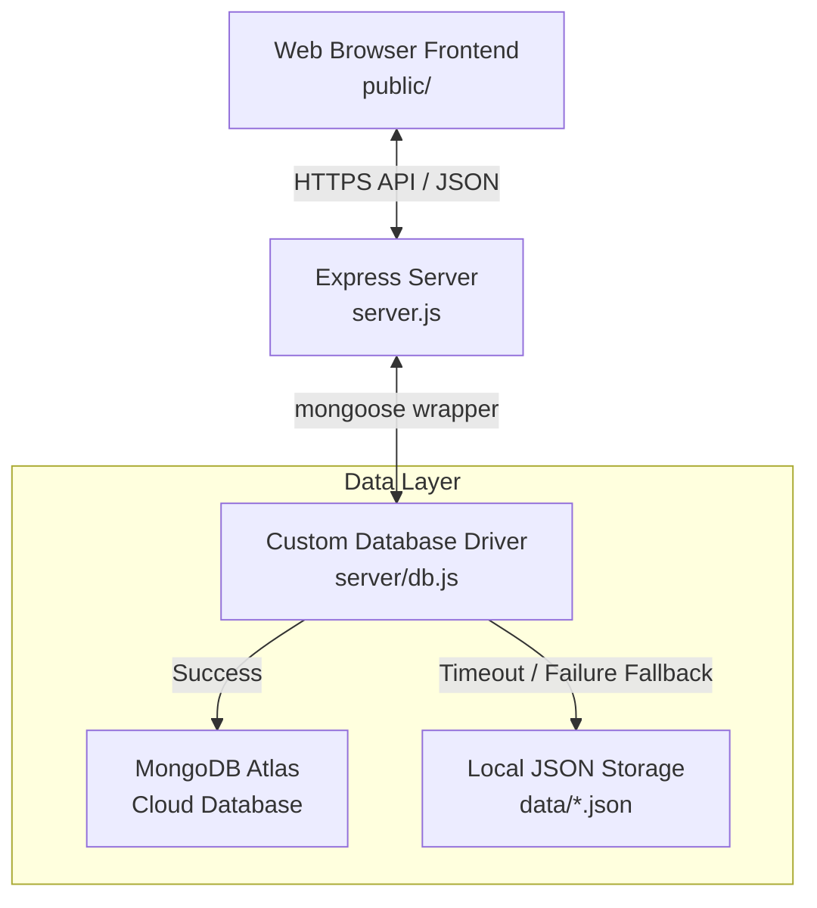
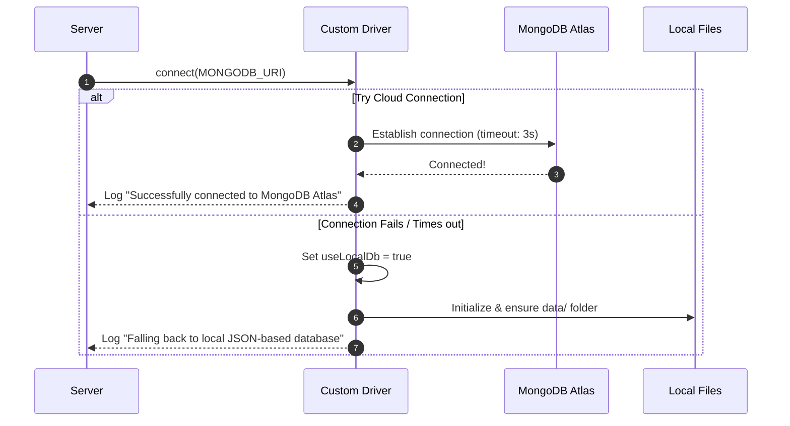
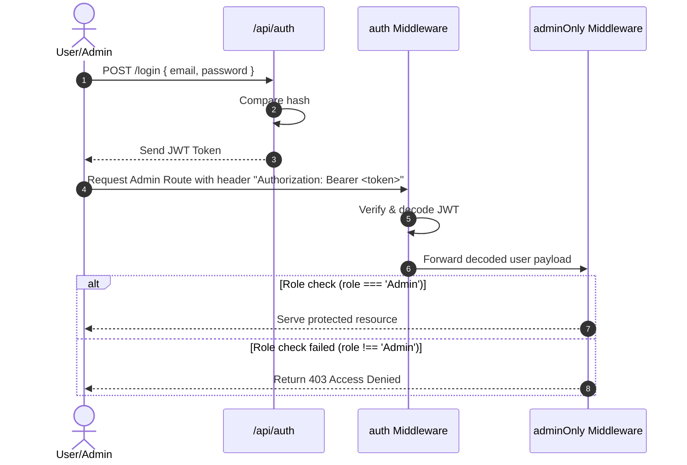
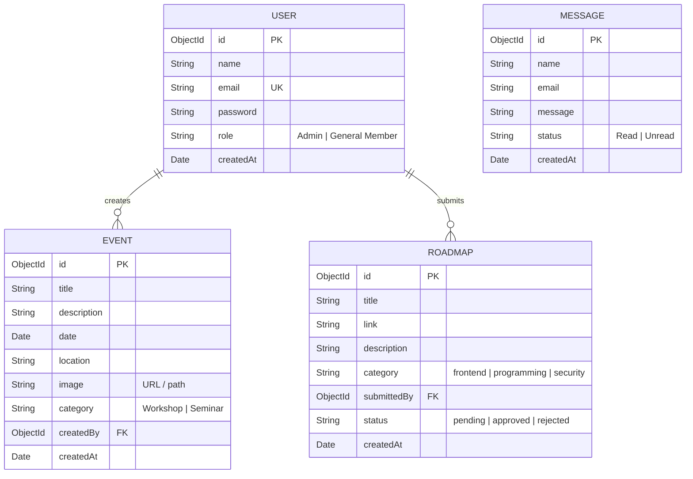
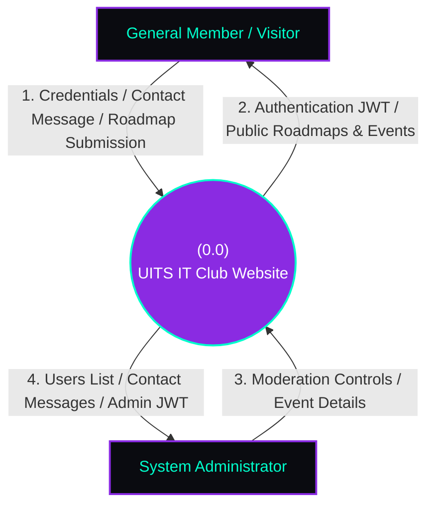
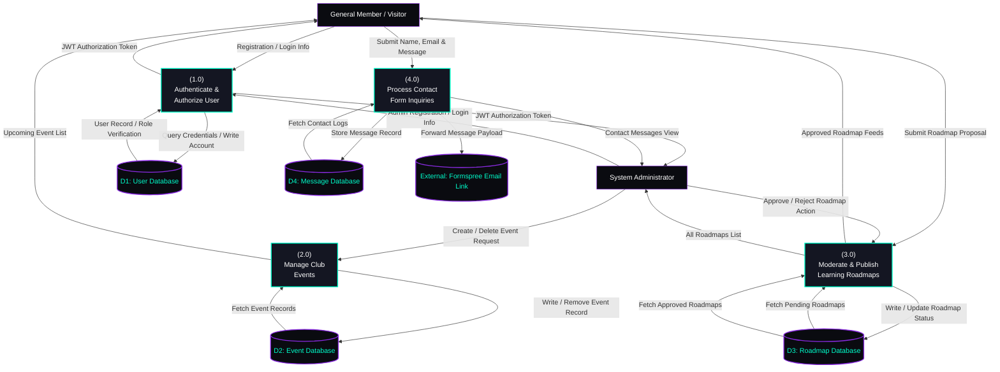

# 🏛️ Architecture & System Design Documentation

This document explains the technical architecture, design patterns, and engineering choices of the **UITS IT Club Web Platform**. It serves as a blueprint for developers wanting to understand the inner workings of the platform's dual-database driver, authentication pipeline, and styling system.

---

## 🧭 Architectural Overview

The platform uses a classic **Client-Server-Database** architecture built using Node.js, Express, and a custom database wrapper.

---

## 🔄 Dual-Database Fallback Engine

A primary highlight of this codebase is its **Dual-Database Architecture**, coded inside [server/db.js](file:///e:/club%20update%2020%20april%202026/server/db.js). It guarantees **100% out-of-the-box local execution** without needing a local MongoDB daemon or cloud database setup.

### Connection & Transition Flow

At server startup:
1. The entry point [server.js](file:///e:/club%20update%2020%20april%202026/server.js) triggers `mongoose.connect(URI)`.
2. The wrapper tries to establish a Mongoose connection to the remote MongoDB Atlas cluster.
3. It sets a strict **3-second timeout** (`serverSelectionTimeoutMS: 3000`).
4. **If connection succeeds**: The application operates in Standard MongoDB mode using MongoDB's remote servers.
5. **If connection fails (timeout or network error)**: It catches the exception, switches `useLocalDb` flag to `true`, and transparently handles all model operations locally using file-based JSON.

### Fallback Implementation Details

The wrapper implements high-fidelity mocks of standard Mongoose components:

1. **`CustomSchema`**: Standard constructor mimicking Mongoose schemas. It supports hooks (`.pre('save', ...)`), methods (`methods.comparePassword`), and static types (`Types.ObjectId`).
2. **`LocalQuery`**: An implementation of Mongoose's chainable Query Builder supporting:
   *   `.sort(sortObj)`: In-memory JavaScript sorting that supports multi-key sorts, dates, string comparison, and ascending/descending modes.
   *   `.select(selectStr)`: In-memory inclusion/exclusion of properties (e.g., `-password`).
   *   `.populate(pathField, selectFields)`: Resolves relational ObjectIds (e.g., populating `submittedBy` in roadmaps from the `User` store) while keeping sensitive credentials safe.
3. **`Proxy Wrapper`**: A JavaScript ES6 Proxy that wraps both MongoDB instances and Local Model objects, keeping the interface identical for routers and middleware (e.g., `model.save()`, `model.findOne()`, `model.findByIdAndDelete()`).

### JSON File Seeding

When in fallback mode, the driver interacts with standard JSON files in the `data/` folder (e.g., `User.json`).
*   To prevent developers from being locked out, the driver **automatically seeds a default Admin User** in `data/User.json` if it does not already exist.
*   The password `password123` is securely hashed using **bcryptjs** synchronous salt rounds before writing, replicating production conditions locally.

---

## 🔐 Security & Authentication Architecture

The UITS IT Club Web Platform implements a secure authentication layer leveraging **JSON Web Tokens (JWT)** and **bcryptjs**.

### Key Components

1.  **JWT Signing & Verification**:
    *   Signed during registration and login via the keys loaded from `JWT_SECRET`.
    *   Stores `id` and `role` to limit round-trips to the database during authorization.
2.  **Authentication Middleware** ([server/middleware/auth.js](file:///e:/club%20update%2020%20april%202026/server/middleware/auth.js)):
    *   **`auth`**: Extracts the `Bearer` token from the `Authorization` header, verifies its integrity, decodes the claims, and attaches the payload to `req.user`.
    *   **`adminOnly`**: Verifies `req.user.role === 'Admin'`. Denies access with a HTTP `403 Forbidden` if the rule is violated.
3.  **Default Role Assignment**:
    *   The platform allocates the **`Admin`** role to accounts registered with the specific email `04324205191008@uits.edu.bd`.
    *   All other registered emails automatically default to **`General Member`**.

---

## 📊 Database & Data Flow Architecture

This section details the physical database schema structure and the logical data flow models representing how data migrates through the UITS IT Club platform.

### 1. Database Entity-Relationship Diagram (ERD)

The system consists of four primary models: `User`, `Event`, `Roadmap`, and `Message`. Relationships are modeled via references (ObjectIds) mapping back to the `User` schema.

---

### 2. Data Flow Diagram (DFD) - Level 0 (Context Diagram)

The Context Diagram defines the logical boundary of the platform, identifying the information flowing between external agents (General Members/Visitors and System Administrators) and the application boundary.

---

### 3. Data Flow Diagram (DFD) - Level 1 (Functional Decomposition)

Level 1 breaks down the core processes, showing sub-processes, detailed data routes, and direct transactions with physical databases/JSON stores.

---

## 🎨 UI/UX Design System

The application boasts a custom **Cybersecurity / Cyberpunk Aesthetic** built entirely using clean, premium vanilla CSS in [public/style.css](file:///e:/club%20update%2020%20april%202026/public/style.css).

### Design Tokens & Variables

Key stylesheet values are configured as reusable CSS variables:

| Token | CSS Variable | Value | Description |
| :--- | :--- | :--- | :--- |
| **Primary Color** | `--primary` | `#00ffcc` | A high-vibrancy cyan representing glowing terminals. |
| **Secondary Color** | `--secondary` | `#8a2be2` | Deep electric purple for contrasting details and accents. |
| **Background Dark** | `--bg-dark` | `#0a0b10` | Sleek charcoal black base background. |
| **Card Background** | `--card-bg` | `rgba(20, 22, 34, 0.65)` | Semi-translucent base for glassmorphism panels. |
| **Border Color** | `--border-color` | `rgba(0, 255, 204, 0.15)` | Glowing outline borders. |
| **Typography** | `--font-main` | `'Outfit', sans-serif` | Clean, geometric font for high-tech modernity. |

### Micro-Animations & Dynamic Interactions

The premium look is reinforced by several subtle interactions:
*   **Glassmorphism**: Cards feature `backdrop-filter: blur(12px)` combined with fine translucent borders and slight gradients.
*   **Hover Glow**: Interactive components (buttons, navbar items, category nodes) scale up slightly and trigger a soft drop-shadow glow using `box-shadow: 0 0 15px rgba(0, 255, 204, 0.4)`.
*   **Dynamic Background Panels**: Pages feature floating radiant background circles with slow translations and blurs to create high depth.
*   **Cyber Security Terminal Theme**: Subtle terminal fonts (`Courier New`, monospace) utilized for tech widgets, admin badges, and syntax blocks.
